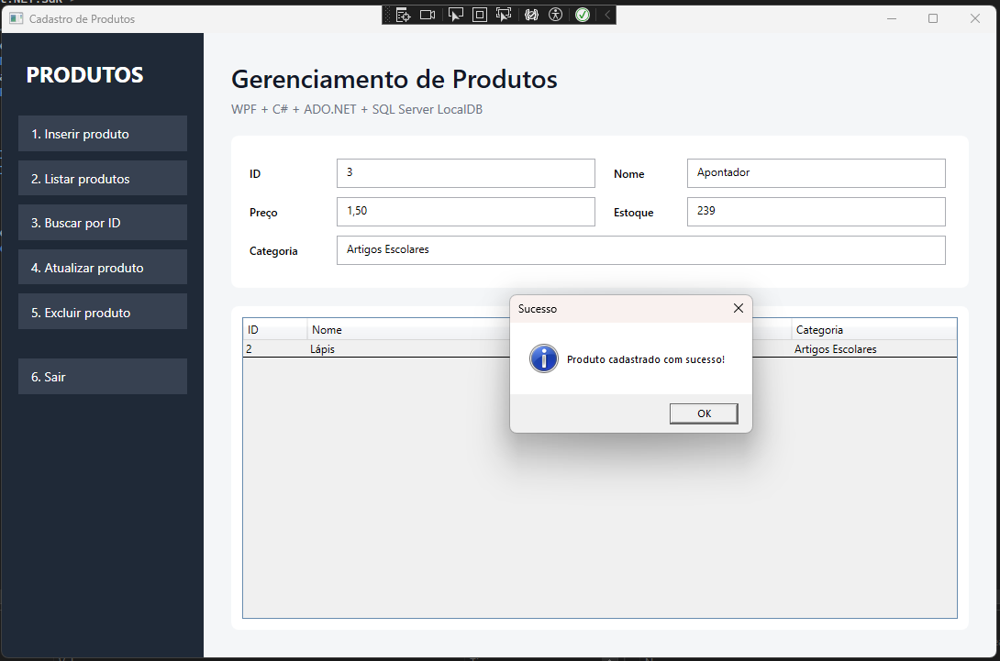
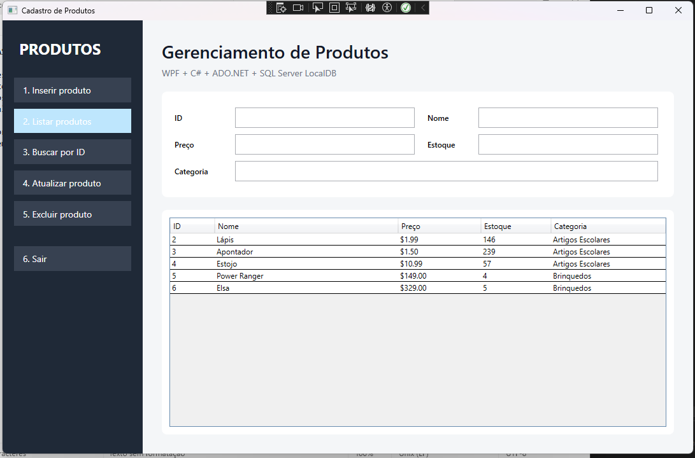
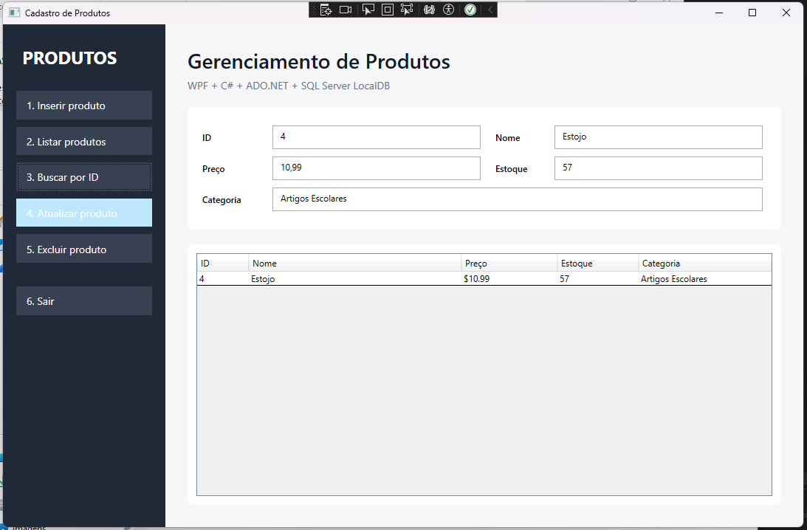
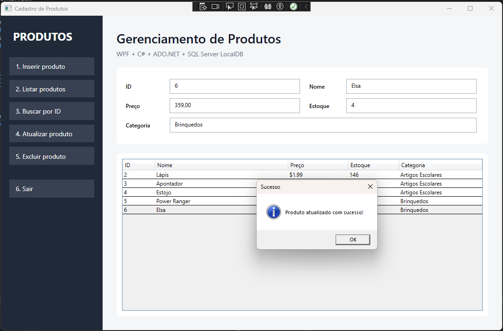

# Cadastro de Produtos — WPF + C# + ADO.NET

Aplicação desktop desenvolvida em **C# com WPF** para cadastrar e gerenciar produtos utilizando **ADO.NET** e **SQL Server LocalDB**.

## Desenvolvido por Luan Orlandelli Ramos RM554747

## Objetivo

O projeto demonstra:

- conexão com banco de dados usando ADO.NET;
- CRUD completo de produtos;
- comandos SQL parametrizados para prevenção de SQL Injection;
- `ExecuteNonQuery` em INSERT, UPDATE e DELETE;
- `ExecuteReader` em SELECT;
- mapeamento manual de `SqlDataReader` para objetos `Produto`;
- tratamento de exceções de banco de dados;
- registro das operações em arquivo de log;
- separação entre interface, modelo, configuração, serviço e Repository.

## Funcionalidades

1. Inserir produto;
2. Listar produtos;
3. Buscar produto por ID;
4. Atualizar produto;
5. Excluir produto;
6. Sair.

## Tecnologias

- C#;
- .NET 8;
- WPF;
- ADO.NET;
- Microsoft.Data.SqlClient;
- SQL Server LocalDB;
- JSON para configuração da connection string.

## Estrutura do projeto

```text
CadastroProdutosWPF/
├── CadastroProdutosWPF.sln
├── CadastroProdutos/
│   ├── Models/
│   │   └── Produto.cs
│   ├── Repositories/
│   │   └── ProdutoRepository.cs
│   ├── Services/
│   │   └── ArquivoLogger.cs
│   ├── Helpers/
│   │   └── ConfiguracaoBanco.cs
│   ├── App.xaml
│   ├── App.xaml.cs
│   ├── MainWindow.xaml
│   ├── MainWindow.xaml.cs
│   ├── appsettings.json
│   └── CadastroProdutos.csproj
├── Database/
│   └── criar_banco.sql
├── Prints/
│   └── README.txt
├── .gitignore
└── README.md
```

## Pré-requisitos

- Windows 10 ou 11;
- Visual Studio 2022;
- workload **Desenvolvimento para desktop com .NET**;
- .NET 8 SDK;
- SQL Server Express LocalDB.

O LocalDB normalmente é instalado junto com o Visual Studio. Caso não esteja disponível, instale o SQL Server Express LocalDB.

## 1. Criar o banco de dados

Abra o **SQL Server Management Studio**, **Azure Data Studio** ou o **SQL Server Object Explorer** do Visual Studio.

Conecte-se em:

```text
(localdb)\MSSQLLocalDB
```

Abra e execute o arquivo:

```text
Database/criar_banco.sql
```

O script cria o banco `CadastroProdutosDb`, cria a tabela `Produtos` e insere três registros de exemplo.

## 2. Connection string

A connection string fica em `CadastroProdutos/appsettings.json`, conforme solicitado na atividade:

```json
{
  "ConnectionStrings": {
    "DefaultConnection": "Data Source=(localdb)\\MSSQLLocalDB;Initial Catalog=CadastroProdutosDb;Integrated Security=True;TrustServerCertificate=True;"
  }
}
```

Se o seu SQL Server utilizar outra instância, altere apenas esse arquivo.

## 3. Executar o projeto

1. Abra `CadastroProdutosWPF.sln` no Visual Studio 2022.
2. Aguarde a restauração dos pacotes NuGet.
3. Confirme que o projeto `CadastroProdutos` está definido como projeto de inicialização.
4. Pressione **F5** ou clique em **Iniciar**.

## CRUD e ADO.NET

A classe `ProdutoRepository` concentra o acesso ao banco.

Métodos implementados:

```text
Inserir(Produto produto)
Listar()
BuscarPorId(int id)
Atualizar(Produto produto)
Excluir(int id)
```

As operações INSERT, UPDATE e DELETE utilizam `ExecuteNonQuery`.

As operações SELECT utilizam `ExecuteReader`.

## Prevenção contra SQL Injection

Nenhum valor digitado pelo usuário é concatenado diretamente no SQL.

Exemplo:

```csharp
const string sql = "DELETE FROM Produtos WHERE Id = @Id;";
comando.Parameters.Add("@Id", SqlDbType.Int).Value = id;
```

Dessa forma, os dados são enviados ao SQL Server como parâmetros, reduzindo o risco de SQL Injection.

## Mapeamento manual do DataReader

O retorno do banco é convertido manualmente para `Produto`:

```csharp
private static Produto MapearProduto(SqlDataReader reader)
{
    return new Produto
    {
        Id = reader.GetInt32(reader.GetOrdinal("Id")),
        Nome = reader.GetString(reader.GetOrdinal("Nome")),
        Preco = reader.GetDecimal(reader.GetOrdinal("Preco")),
        Estoque = reader.GetInt32(reader.GetOrdinal("Estoque")),
        Categoria = reader.GetString(reader.GetOrdinal("Categoria"))
    };
}
```

## Tratamento de erros

As operações de banco tratam `SqlException`. O Repository registra o erro e lança uma mensagem mais amigável para a interface.

A interface também possui tratamento de exceções para evitar que a aplicação seja encerrada inesperadamente.

## Logs

As operações realizadas são registradas automaticamente em:

```text
CadastroProdutos/bin/Debug/net8.0-windows/Logs/operacoes.log
```

Exemplos de registros:

```text
2026-09-30 20:10:00 | INSERT | Produto 'Lápis' cadastrado.
2026-09-30 20:10:15 | SELECT LISTAR | 4 produto(s) retornado(s).
2026-09-30 20:11:03 | UPDATE | Produto 1 | Linhas afetadas: 1.
```

## Prints para entrega

### Inserir produto



### Listar produtos



### Buscar produto por ID



### Atualizar produto




## Vídeo de apresentação do projeto


